# Ian Xiaohei Illustrations (PT-BR · Grok)

> Transforme julgamentos, fluxos, estados e metáforas de um artigo em ilustrações de corpo de texto: fundo branco, traço à mão, absurdas mas limpas.
>
> 16:9 horizontal · IP Xiaohei 1.0 · anotações curtas (PT-BR) · **Grok Build** (`image_gen` / `image_edit`)
>
> **Hub:** também roteia **Scenes 2.0** e **Handdrawn PPT** (skills irmãs neste workspace).

**Este repositório** = adaptação **português BR + Grok** mantida em [ggampp/ian-xiaohei-illustrations](https://github.com/ggampp/ian-xiaohei-illustrations).

Conceito, IP **小黑 (Xiaohei)** e skill original: **Ian** — [helloianneo/ian-xiaohei-illustrations](https://github.com/helloianneo/ian-xiaohei-illustrations) (MIT).

---

## O que é

Skill de agente para **ilustrações de corpo de texto** no estilo Xiaohei 1.0 (rascunho de quadro). Não é template de PPT nem ilustração comercial: o fluxo é achar a **âncora cognitiva** e desenhar **um** julgamento, fluxo ou metáfora memorável.

Como **hub** da família visual:

| Modo | Repositório (fork PT-BR/Grok) | Quando usar |
|------|------------------------------|-------------|
| `illustrations` | **este** | Método, fluxo, estrutura, comparação de produto |
| `scenes` | [ggampp/ian-xiaohei-scenes](https://github.com/ggampp/ian-xiaohei-scenes) | Situação humana, objeto real, long-scroll |
| `handdrawn-ppt` | [ggampp/ian-handdrawn-ppt](https://github.com/ggampp/ian-handdrawn-ppt) | Capa **20:9** + páginas PNG “tipo PPT” |

Upstream (chinês / Codex), se quiser comparar:

- [helloianneo/ian-xiaohei-illustrations](https://github.com/helloianneo/ian-xiaohei-illustrations)
- [helloianneo/ian-xiaohei-scenes](https://github.com/helloianneo/ian-xiaohei-scenes)
- [helloianneo/ian-handdrawn-ppt](https://github.com/helloianneo/ian-handdrawn-ppt)

IP Xiaohei: silhueta preta, olhos brancos, pernas finas, expressão vazia — **faz a ação central**, não decora.

---

## Exemplos gerados neste fork (Grok)

Amostra real do pipeline **PT-BR + `image_gen`**, tema S/4HANA / RAP vs Tachyonix (modo **illustrations**). Use como referência de estilo e densidade de rótulos — **não** como molde de composição.

### Duas rotas no S/4HANA

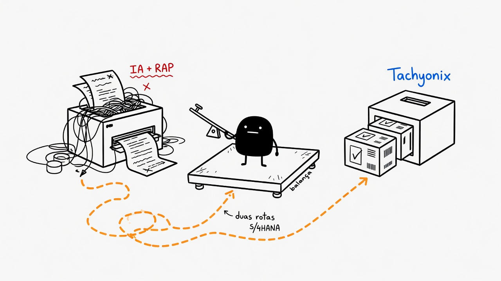

### Código IA e débito técnico

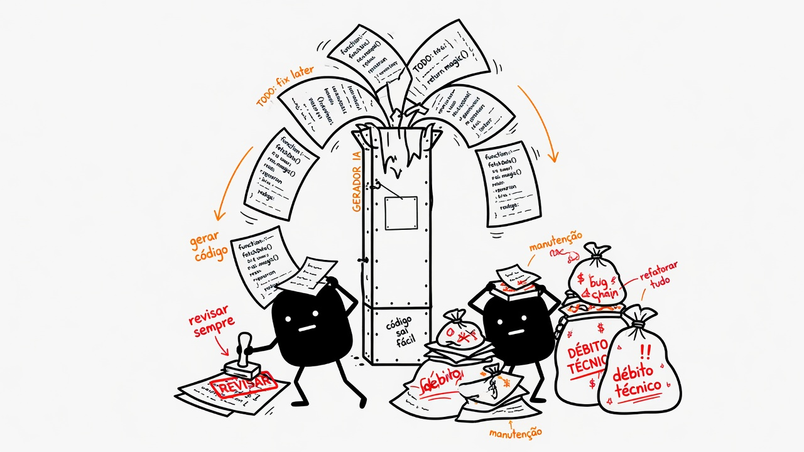

### Motor determinístico

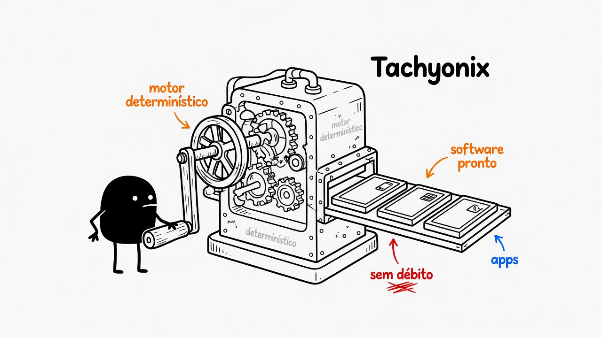

### Fiori e Clean Core

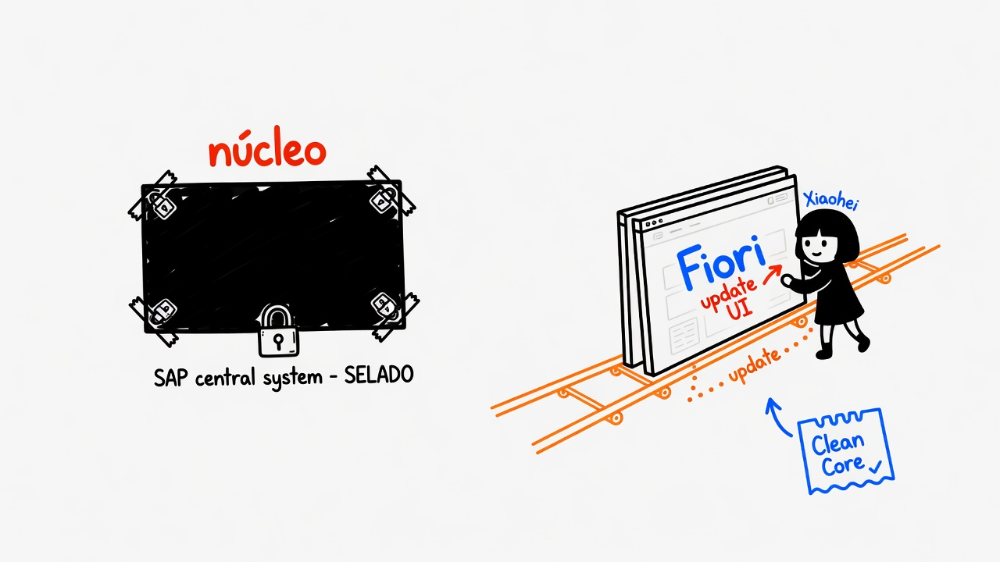

### Feature acorrentada ao upgrade

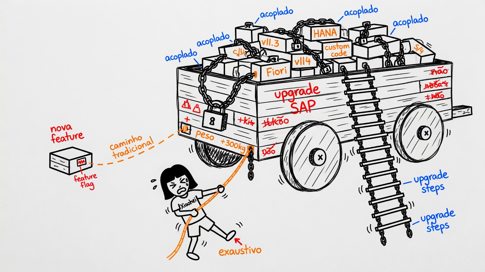

### Sinergia: specs → apps

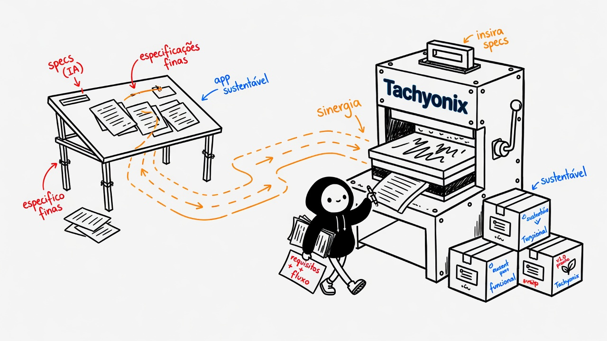

### Manutenção e ciclo de vida

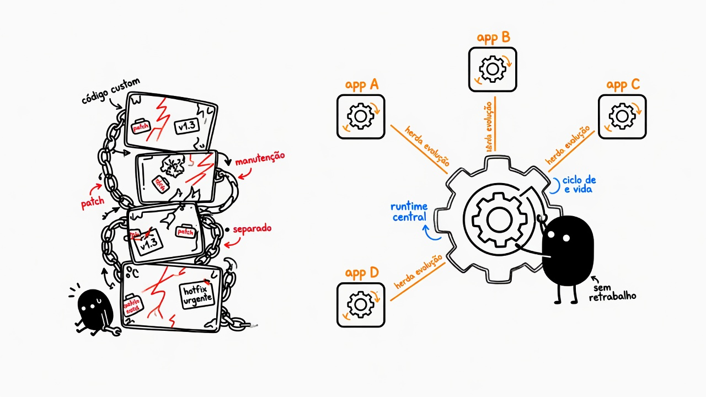

Pasta: `assets/sap-rap-vs-tachyonix-illustrations/`.

---

## Teste dos três modos (mesmo hub)

Smoke test após instalar as skills no Grok:

| Modo | Arquivo |
|------|---------|
| Illustrations 1.0 | 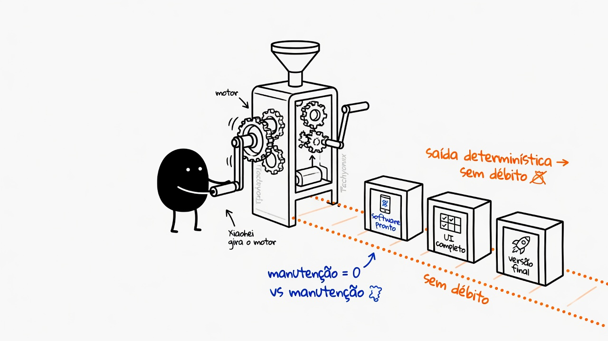 |
| Scenes 2.0 | 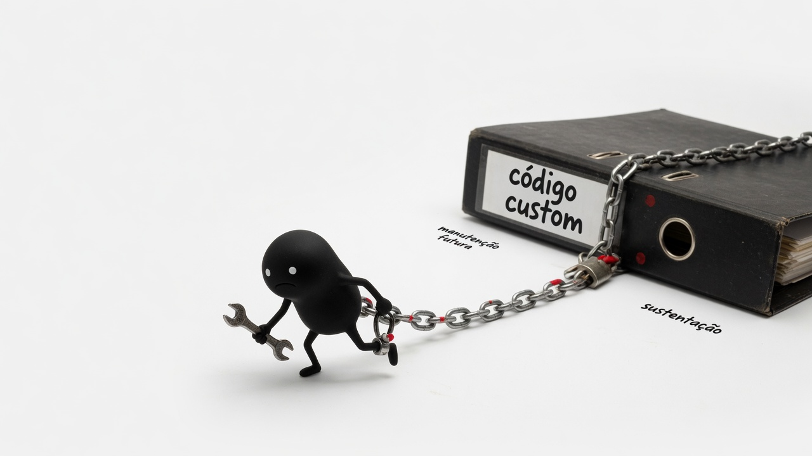 |
| Handdrawn PPT (página) | 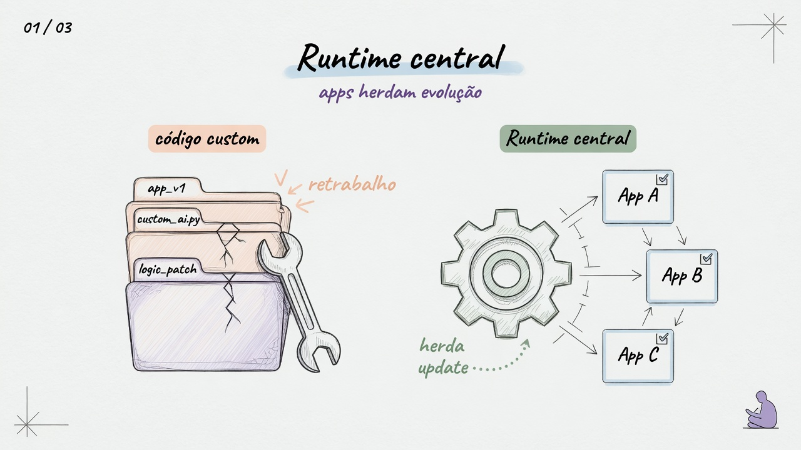 |
| Handdrawn PPT (capa 20:9) | 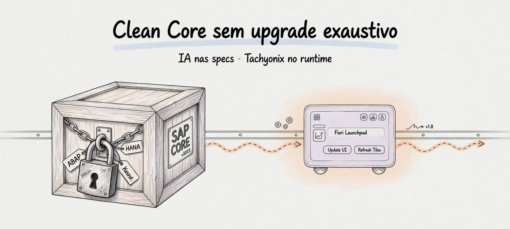 |

Pasta: `assets/grok-skill-test/`.

> Os PNGs em `examples/images/` e `ian-xiaohei-illustrations/assets/examples/` vêm do **upstream** (Ian) e servem só como calibração de traço/vazio na skill — o README desta página prioriza os exemplos **deste fork**.

---

## Para quem serve

**Serve:** artigos/metodologia em português, workflows de IA, metáforas de produto, uso estável no **Grok**.

**Não serve:** KV comercial, fluxograma formal denso, cartoon fofo, SVG editável, despejar parágrafo na imagem.

---

## O que entrega

- Ilustrações **16:9** (corpo); capa PPT / long-scroll em **20:9** (a API Grok **não** aceita `21:9`)
- Shot list 4–8 itens; PNG via `image_gen`
- Pasta sugerida: `assets/<slug>-illustrations/`

**Não** entrega por padrão: PPTX, PDF, SVG.

---

## Estilo (modo illustrations)

- Fundo branco puro  
- Traço preto à mão, muito vazio (~40–60% de sujeito)  
- Poucos rótulos manuscritos em vermelho / laranja / azul  
- Uma imagem = um núcleo; Xiaohei na ação  

---

## Instalação no Grok Build

```bash
git clone git@github-pessoal:ggampp/ian-xiaohei-illustrations.git
# ou: git clone https://github.com/ggampp/ian-xiaohei-illustrations.git
cd ian-xiaohei-illustrations
```

**Windows (PowerShell):**

```powershell
$dest = Join-Path $env:USERPROFILE ".grok\skills\ian-xiaohei-illustrations"
New-Item -ItemType Directory -Force -Path (Split-Path $dest) | Out-Null
Copy-Item -Recurse -Force ".\ian-xiaohei-illustrations" $dest
```

**macOS / Linux:**

```bash
mkdir -p "${HOME}/.grok/skills"
cp -R ./ian-xiaohei-illustrations "${HOME}/.grok/skills/"
```

Skills irmãs (recomendado para o hub completo):

```powershell
# após clonar ggampp/ian-xiaohei-scenes e ggampp/ian-handdrawn-ppt
Copy-Item -Recurse -Force ".\ian-xiaohei-scenes" "$env:USERPROFILE\.grok\skills\ian-xiaohei-scenes"
Copy-Item -Recurse -Force ".\ian-handdrawn-ppt"  "$env:USERPROFILE\.grok\skills\ian-handdrawn-ppt"
```

Uso:

```text
Use a skill ian-xiaohei-illustrations e gere 5 ilustrações do Xiaohei
para este artigo em português (16:9, image_gen).
```

---

## Como usar

### Só planejar

```text
Use a skill ian-xiaohei-illustrations — não gere ainda.
Shot list (~5): parágrafo, tema, ideia, estrutura, ação do Xiaohei, rótulos.

<cole o artigo>
```

### Gerar

```text
Use a skill ian-xiaohei-illustrations e gere 4 ilustrações do Xiaohei.
16:9, fundo branco, traço à mão, rótulos curtos em português.

<cole o artigo>
```

### Hub (rotear modos)

```text
Use a skill ian-xiaohei-illustrations (hub):
illustrations para método, scenes para dor de manutenção,
handdrawn-ppt para 1 capa 20:9.
```

Mais prompts: [examples/prompts.md](examples/prompts.md).

---

## Ferramentas Grok

| Tarefa | Ferramenta |
|--------|------------|
| Nova imagem | `image_gen` + ratio (`16:9` ou `20:9`) |
| Editar | `image_edit` |
| QA visual | `read_file` na imagem |

---

## Estrutura

```text
.
├── README.md
├── LICENSE
├── NOTICE.md
├── assets/
│   ├── sap-rap-vs-tachyonix-illustrations/   ← exemplos deste fork
│   ├── grok-skill-test/                      ← smoke test 3 modos
│   └── ian-wechat-qr.jpg                     ← QR do autor original (Ian)
├── examples/
│   ├── images/                               ← calibração upstream (Ian)
│   └── prompts.md
└── ian-xiaohei-illustrations/                ← skill instalável
    ├── SKILL.md
    ├── references/   (incl. ecosystem-routing, mode-scenes, mode-handdrawn-ppt)
    └── assets/examples/                      ← calibração upstream na skill
```

---

## Cuidados

- Rótulos curtos = texto mais estável no modelo de imagem.  
- Uma ideia por figura.  
- Se remover o Xiaohei e a metáfora “ainda funciona sozinha”, regenere.  
- Exemplos = calibração, não molde.  
- Não misture DNA 1.0 (traço) com 2.0 (props foto) no mesmo canvas.  

---

## Créditos

| Papel | Quem |
|-------|------|
| Conceito, IP Xiaohei, skill original | [Ian (helloianneo)](https://github.com/helloianneo) · [ianneo.xyz](https://www.ianneo.xyz) |
| Adaptação PT-BR, hub Grok, exemplos neste README | [Guilherme Pimentel (ggampp)](https://github.com/ggampp) |

Licença: **MIT** — ver [LICENSE](LICENSE) e [NOTICE.md](NOTICE.md).
